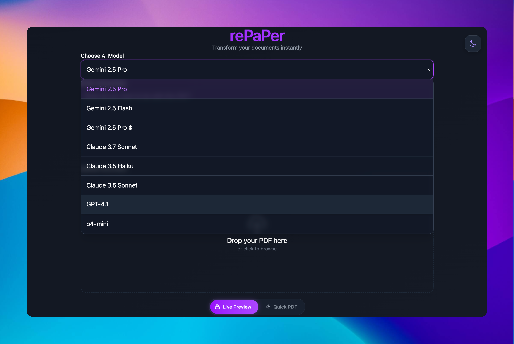
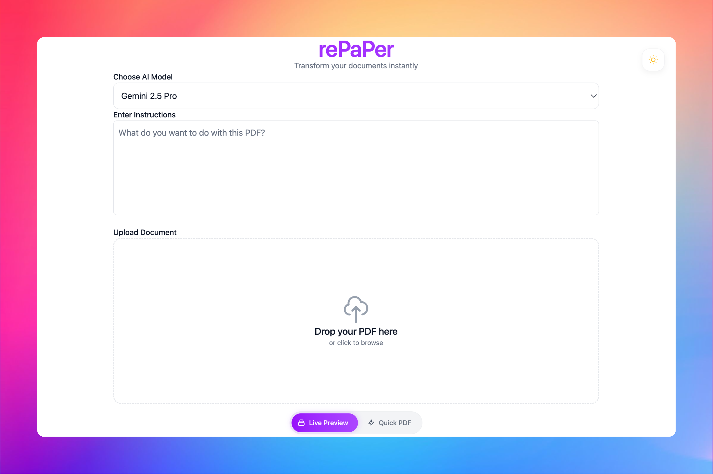

# 📄 rePaPer

> Stop drowning in documents. Get the gist, fast, with intelligent AI Agents. ✨

rePaPer leverages powerful AI Agents to transform lengthy PDFs into concise, easy-to-digest summaries. Upload your document, choose your preferred AI (Anthropic Claude or Google Gemini), and get a beautifully formatted summary delivered as a downloadable PDF. Spend less time reading and more time understanding.

## 🤩 See rePaPer in Action!

<p align="center">
  
  &nbsp;&nbsp;&nbsp;&nbsp;
  
</p>
<br/>

## 🎯 Why Most AI Summaries Fall Short

Ever tried to get ChatGPT or any LLM to summarize a large PDF? You get a couple pages of generic fluff, no matter if your doc is 5 pages or 50. Why? Because every LLM has a hard limit on how much it can output in one go. So you end up with:

*   Summaries that are always the same length, regardless of the input.
*   Important details, tables, and nuance? Lost. Context? Missing. Depth? Not there.
*   You ask for a deep dive, you get a shallow overview.

If you actually want to *understand* a document, not just get a surface-level blurb, you need something smarter. That's where rePaPer comes in.

## 🚀 Why rePaPer is Different (and Better)

rePaPer isn't just another wrapper around an LLM. It's a multi-agent system that:

*   **🧠 Uses Multiple AI Models**: Anthropic Claude, Google Gemini, and OpenAI (GPT-4.1, o4-mini, and more). Pick your favorite, or let the system choose.
*   **🤖 Orchestrates Like a Pro**: An AI "orchestrator" agent reads your PDF, breaks it into logical sections, and assigns each chunk to a specialized summarizer agent. No more one-size-fits-all summaries.
*   **🌍 Multilingual by Default**: You can give instructions in any language, and rePaPer will adapt. Want your summary in Spanish, French, or another language? Go for it.
*   **📏 Scales With Your Doc**: The summary grows with the document. 5 pages? 5 pages of insight. 50 pages? You get a summary that actually covers the whole thing.
*   **📊 Tables & Data Included**: Important tables are preserved and included in your summary. No more missing data.
*   **🎨 Beautiful PDF Output**: You get a clean, readable PDF that you can actually use, share, or present.
*   **⚡ Real-Time Progress**: See exactly what's happening as your doc is processed. No more staring at a spinner, wondering if it's working.
*   **✨ Effortless UI**: Drag, drop, done. Dark mode, light mode, whatever you want.

## ✨ See a Real Example!

Curious about the kind of in-depth summary rePaPer can produce? We've processed the seminal "Attention Is All You Need" paper (the foundation for Transformers!) and made the output available.

*   **Read the original paper**: [Attention Is All You Need (Vaswani et al., 2017) on arXiv](https://arxiv.org/pdf/1706.03762)
*   **Check out rePaPer's summary**: Explore the `examples/Attention_Is_All_You_Need` directory to see the detailed PDF summary generated by rePaPer.

To achieve this level of detail and cater to specific needs, rePaPer can understand and act on nuanced instructions. For the "Attention Is All You Need" summary, this was the guidance provided:

> _"I'm studying from this article to understand its impact in LLM development. I am a Mathematician. I find analogies with number theory very useful to understand other concepts. Include in the end a section for non-technical readers where you explain the importance of this discovery and write a general overview of the concepts introduced in it."_

This example showcases how rePaPer takes your specific context and requirements to break down complex documents into comprehensive, easy-to-digest insights tailored for you.

### From Cutting-Edge AI to... Economical Cheese Usage! 🧀

But rePaPer isn't just for dissecting dense academic papers. It's versatile enough to tackle a wide range of sources, including practical guides or even unique historical documents, extracting valuable insights.

Check out how rePaPer tackles a U.S. Department of Agriculture Farmers' Bulletin from 1912:

*   **Explore the original bulletin**: [Cheese and Its Economical Uses in the Diet (Langworthy & Hunt, 1912)](https://dn790006.ca.archive.org/0/items/cheeseitseconomi00lang/cheeseitseconomi00lang.pdf) - a 40-page guide from the U.S. Dept. of Agriculture on the food value, selection, care, and varied culinary uses of cheese.
*   **See rePaPer's digestible summary**: Check out the summary PDF at `examples/CHEESE_AND_ITS_ECONOMICAL_USES_IN_THE_DIET.pdf` to see how rePaPer distills this charmingly practical historical document.

This example demonstrates rePaPer's power to:
*   Handle diverse document types, including historical government bulletins.
*   Extract and organize practical information from uniquely structured content.
*   Make even century-old advice accessible and understandable.

## 🔮 On the Horizon: Future Enhancements

rePaPer is constantly evolving! Here are some exciting features we're currently working on to make it even more powerful:

*   **📜 Crystal-Clear LaTeX Equations**: Soon, rePaPer will intelligently identify and beautifully render LaTeX equations from your source documents directly within the summary, ensuring all mathematical details are perfectly preserved and easy to read.
*   **🖼️ Integrated Figures & Images**: We're enhancing rePaPer to not just understand text, but to also incorporate key figures, charts, and images from your PDFs into the final summary, providing a richer, more complete understanding at a glance.

Stay tuned for these and other improvements designed to make rePaPer the ultimate document understanding tool!

## 🚀 Core Features

-   **AI-Powered Summarization**: Leverages state-of-the-art LLMs (OpenAI, Anthropic Claude, Google Gemini) to extract key information.
-   **Flexible Output**: Download summaries as beautifully formatted PDFs.
-   **Model Selection**: Choose between OpenAI, Anthropic, or Gemini models to tailor the summarization style.
-   **Real-time Progress**: Track the summarization process with clear visual feedback.
-   **Sleek Interface**: Enjoy a clean, modern UI with Dark Mode support.
-   **Drag & Drop Upload**: Easily add your PDF files.

## 🛠 Tech Stack

-   **Frontend**: React, TypeScript, Vite, Tailwind CSS
-   **Backend**: FastAPI (Python 3), PydanticAI, Logfire

## 🏃‍♂️ Quick Start

### 🐳 With Docker (Recommended)

The easiest way to get rePaPer running.

1.  **Clone the Repository:**
    ```bash
    git clone https://github.com/camilovelezr/rePaPer.git
    cd rePaPer
    ```

2.  **Set Up Environment Variables:**
    *   **Backend:** Copy the sample environment file and fill in your details:
        ```bash
        cd backend/repaper
        cp .env.sample .env
        # Now edit .env with your API keys (ANTHROPIC_API_KEY, GEMINI_API_KEY, OPENAI_API_KEY) and optionally LOGFIRE_TOKEN
        cd ../.. # Go back to the project root
        ```
    *   **Frontend:** Create a `.env` file inside the `frontend/` directory (`frontend/.env`). Set the API URL:
        ```dotenv
        # Make sure this points to your backend service
        VITE_API_BASE_URL=http://localhost:8000
        ```

3.  **Build and Run with Docker Compose:**
    ```bash
    docker-compose up --build -d
    ```

4.  **Access the App:**
    Open your browser and navigate to `http://localhost:3000` (or the port specified in your `docker-compose.yml` if different). The frontend defaults to port 5173 via Vite, while the backend runs on port 8000.

## 🌍 Environment Variables

Configuration is managed via `.env` files:

*   **`frontend/.env`**: Contains `VITE_API_BASE_URL` pointing to the backend.
*   **`backend/repaper/.env`**: Contains API keys (`ANTHROPIC_API_KEY`, `GEMINI_API_KEY`, `OPENAI_API_KEY`) and optionally the `LOGFIRE_TOKEN`. Copy from `backend/repaper/.env.sample`.

## 📝 Production Build (Frontend)

To create an optimized frontend build:

1.  Navigate to the `frontend/` directory.
2.  Run the build command:
    ```bash
    npm run build
    ```
3.  The production-ready static files will be located in the `frontend/dist/` directory. Deploy these files to your preferred static hosting provider or serve them via a web server like Nginx.

## 🤝 Contributing

Contributions are welcome!

1.  Fork the repository.
2.  Create a new feature branch (`git checkout -b feature/your-amazing-feature`).
3.  Make your changes.
4.  Commit your changes (`git commit -m 'feat: Add some amazing feature'`). Use [Conventional Commits](https://www.conventionalcommits.org/).
5.  Push to the branch (`git push origin feature/your-amazing-feature`).
6.  Open a Pull Request.

Please ensure your code is well-formatted and includes tests where applicable.

## 📝 License

MIT - Go wild, just don't sue me.

## 💡 Why rePaPer?

Because reading entire documents is so 2023. Let AI do the heavy lifting while you focus on what matters - like deciding what to have for lunch.

---

Made with ☕️ and the ghost of "it works on my machine".
